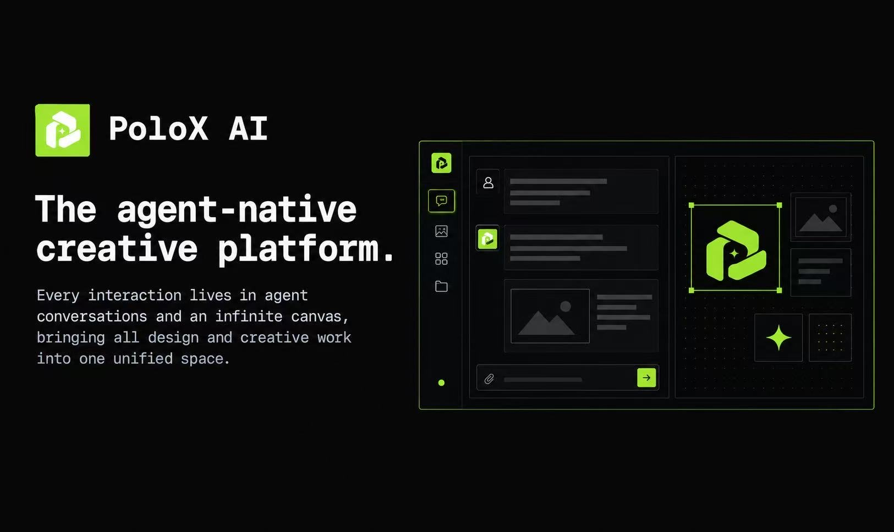
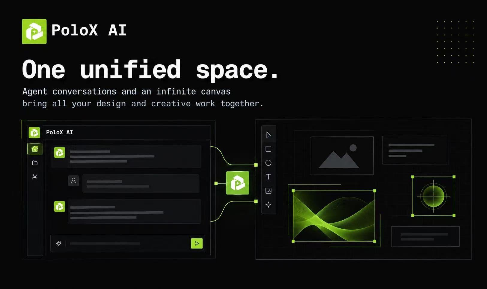
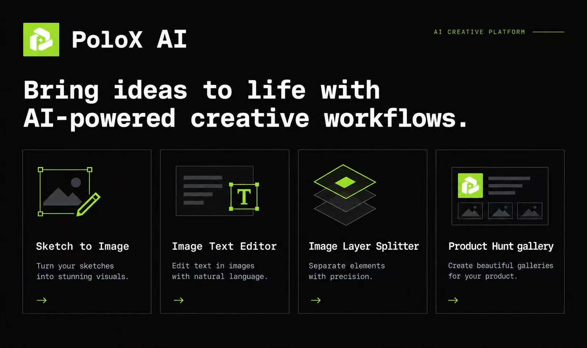
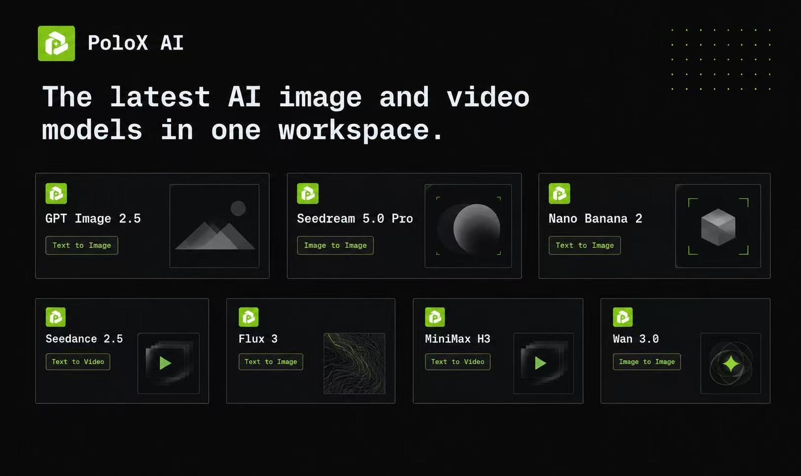
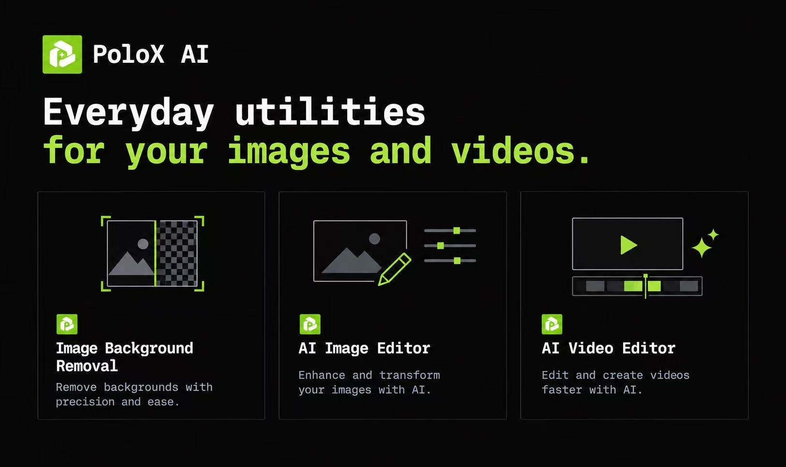

<p align="center">
  
</p>

<h1 align="center">PoloX AI — Multimodal AI Agent</h1>

<p align="center">
  An open-source multimodal AI agent platform, built on DeepSeek Harness.
</p>

<p align="center">
  <a href="LICENSE">MIT License</a>
</p>

<p align="center">
  <strong>English</strong> | <a href="README.zh-CN.md">简体中文</a>
</p>

<p align="center">
  If you run into a problem you cannot resolve, contact me on <a href="https://discord.gg/FwN6s664Dh">Discord</a>.
</p>


<div style="overflow-x: auto; white-space: nowrap; max-width: 100%; margin: 1rem 0 1.5rem; padding-bottom: 0.5rem;">
  
  
  
  
  
 </div>

## Introduction

This is the open-source edition of [PoloX AI](https://polox.ai), a creative platform in the same space as [Lovart](https://lovart.ai) and [Crepal](https://crepal.ai). PoloX takes an **agent-native** approach: agent conversations and an infinite canvas bring creation, generation, and editing into one continuous workflow. Describe what you want, work with the agent, and refine the results on the canvas.

PoloX runs locally with Nuxt, Vue, and SQLite. Bring your own OpenRouter, DeepSeek, or Xiaomi MiMo LLM key, plus a fal or Volcengine Ark image-generation key; no PoloX account or subscription is required. Projects, conversations, generation history, and media are stored on your machine. AI inference uses external providers, so relevant inputs are sent to those services and their API charges apply.

## Install with Codex

Create a new task in Codex and send this prompt:

```text
Help me install PoloX AI locally:
1. Check that Node.js 22.20 or newer and pnpm are installed. Install any missing prerequisites.
2. Install FFmpeg, including ffprobe, for video concatenation and verify that both commands are available.
3. Clone https://github.com/pxsenmaster-coder/polox-ai-domestic and open the project directory.
4. Run pnpm i to install dependencies.
```

## Run locally with Codex

Whenever you want to use PoloX, open the project in Codex and send:

```text
Run pnpm dev in this project and open the local page in the browser. Keep the server running while I use the app.
```

The default address is [http://localhost:3001](http://localhost:3001). **You do not need to run `pnpm build` for everyday local use.**

## Run manually

You need **Node.js 22.20 or newer** and **pnpm**. For the first run:

```sh
git clone https://github.com/pxsenmaster-coder/polox-ai-domestic.git
cd polox-ai-domestic
pnpm i
pnpm dev
```

For subsequent runs, open a terminal in the project directory and run:

```sh
pnpm dev
```

Open [http://localhost:3001](http://localhost:3001) and keep the terminal running. Press `Ctrl+C` to stop the server.

### FFmpeg for video concatenation

Install **FFmpeg and ffprobe** to stitch generated clips into longer videos. Uploads and AI generation do not require them, and `pnpm i` does not install them.

macOS with Homebrew:

```sh
brew install ffmpeg
```

Ubuntu / Debian:

```sh
sudo apt update
sudo apt install ffmpeg
```

On Windows, install an FFmpeg build that includes both tools and add its `bin` directory to your `PATH`. Verify the installation in the terminal used to run PoloX:

```sh
ffmpeg -version
ffprobe -version
```

Restart the development server after installing these tools.

## Connect a language model and an image provider

1. Start PoloX and click the red **API keys not configured** indicator in the top-right corner.
2. In the **Service connection** dialog, choose a language model provider: OpenRouter, [DeepSeek direct](https://platform.deepseek.com/api_keys), or [Xiaomi MiMo direct](https://platform.xiaomimimo.com/console/api-keys).
3. Paste the selected language-model API key. For image generation, configure either a [fal key](https://fal.ai/login?returnTo=%2Fdashboard%2Fkeys) or a Volcengine Ark key (one is enough).
4. Click **Test connection**. Once the language model and at least one image provider pass, the indicator turns green and reads **Services connected**. You are ready to create.

For direct DeepSeek, use **DeepSeek V4 Flash Vision Exp** (`deepseek-v4-flash-vision-exp`) when image understanding is needed. MiMo defaults to `mimo-v2.5-pro`. You can change the Base URL and model ID in the same dialog. MiMo Token Plan users can replace the Base URL with the dedicated endpoint shown in the MiMo console. Connection testing sends a short model request and may incur a small API charge.

## Available AI models

The **Frontier AI models** section on the homepage lists the integrated models. To ask the agent to use a particular model, select it with **@** in your message.

## Creative tools

| Tool | What you can do |
| --- | --- |
| **Image Text Editor** | Edit text inside images. Ask the PoloX agent how to proceed. You can upload multiple images for batch editing. |
| **Image Layer Splitter** | Extract selected elements from an image as separate layers. Upload an image and ask the agent to split it; the agent will guide you through selecting elements or drawing boxes. |
| **Image Background Removal** | Remove an uploaded image's background and keep a transparent PNG. |
| **AI Image Editor** | Upload an image and describe your changes in natural language. Uses image-to-image models. |
| **AI Video Editor** | Upload a video and describe your changes in natural language. Uses reference-to-video models. |

## Long-form video generation

Ask the agent to create a five-minute, ten-minute, or longer video. The workflow generates individual shots with AI video models, then stitches them into a continuous video using FFmpeg. The maintainer has tested ten five-minute videos, with results meeting expectations; this is an early workflow, and results depend on the models and creative brief.

A typical workflow looks like this:

1. **Plan the storyboard.** The agent works from your brief to plan scenes and shots.
2. **Establish the characters.** The agent creates character reference sheets, such as three-view references. You can also upload your own character images and ask the agent to use them.
3. **Create first frames.** The agent uses the character references to generate a first-frame image for each shot, helping maintain visual consistency.
4. **Generate the clips.** Video models turn the planned shots and reference images into video segments.
5. **Assemble the video.** Once the clips are ready, the agent stitches them together in storyboard order.

After assembly, continue the conversation to revise shots or add scenes. You can guide the whole process through the agent.

The [long-form video skill](server/agent/skills/long-form-video.md) defines this workflow and still has room for improvement—for example, using audio references to maintain consistent character voices. Suggestions and contributions are welcome through [Issues](https://github.com/pxsenmaster-coder/polox-ai-domestic/issues).

## Troubleshooting and feedback

If installation or usage goes wrong, ask Codex to inspect the error and help you resolve it. Share the relevant error message and what you were trying to do.

If you find a bug or an improvement that would help other users, please [open an issue](https://github.com/pxsenmaster-coder/polox-ai-domestic/issues). Codex can help you draft and submit it. Include steps to reproduce, your operating system, and relevant logs; remove API keys and other private information before sharing.

## Local data

PoloX stores its SQLite database at `.data/polox.sqlite` and media under `.data/media`. Back up the entire `.data` directory with the server stopped to preserve your projects and files. API keys are stored in the local database, so keep backups private.

This edition is intended for local use. Its workspace routes do not require authentication; keep the app on your machine or a private network.

## Open-source foundations

Thanks to the projects that make PoloX possible:

| Role | Project |
| --- | --- |
| Application framework | [Nuxt](https://github.com/nuxt/nuxt) |
| UI foundation | [shadcn/ui](https://github.com/shadcn-ui/ui) and its Vue ecosystem |
| UI template | [nuxt-shadcn-dashboard](https://github.com/dianprata/nuxt-shadcn-dashboard) |
| Agent harness | [DeepSeek Harness](https://github.com/deepseek-ai/deepseek-harness) |

## License

Released under the [MIT License](LICENSE). Original third-party copyright and license notices are retained.

## Contact

If you run into a problem you cannot resolve, contact me on [Discord](https://discord.gg/FwN6s664Dh).
